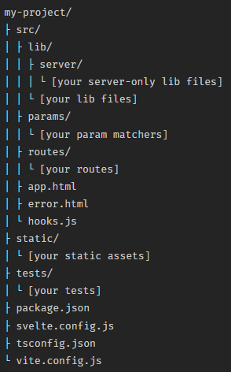

# Acceptatieplan SSI

### Versie 2

## Auteurs

Wouter de Boer  
Daniel Hofman  
Hylbren Rijnders  
Mees van Dijk

# Inhoudsopgave
1. Inleiding  
   1.1 Doel van dit document  
   1.2 Referenties
2. Verantwoordelijkheden  
3. Acceptatiecriteria  
   3.1 Performance  
   3.2 Beheerbaarheid   
   3.3 Betrouwbaarheid  
   3.4 Beveiliging  
   3.5 Funcitonaliteit  
   3.6 Gebruiksvriendelijkheid  
   3.7 Standaards   
   3.8 Documentatie  

# 1 Inleiding

## 1.1 Doel van dit document
Dit Acceptatie Plan verschaft een meetbare basis voor de te accepteren werkproducten. Het bevat een lijst met meetbare acceptatiecriteria die invulling geven aan niet-functionele requirements, Use Case overstijgende eisen en de procedure waarop we bepalen of het project geaccepteerd wordt. 

## 1.2 Referenties
| Titel       | Vindplaats               |
| ----------- | ------------------------ |
| RUP op maat | http://www.rupopmaat.nl/ |

# 2 Verantwoordelijkheden
| Naam               | Rol               |
| ------------------ | ----------------- |
| Wouter de Boer     | projectlid        |
| Daniel Hofman      | projectlid        |
| Hylbren Rijnders   | projectlid        |
| Mees van Dijk      | projectlid        |
| Reimer Wartena     | opdrachtgever     |
| Matthieu Kroezen   | opdrachtgever     |
| Jan van Mullingen  | opdrachtgever     |
| Martijn Riemersma  | projectbegeleider | <--- ???

# 3 Acceptatiecriteria

## 3.1 Performance
Om de performance van de applicatie op niveau te krijgen zal de applicatie aan een aantal eisen moeten voldoen. Deze eisen zijn erg algemeen en klein gezien het project een proof of concept is en vanuit de opdrachtgever ook is aangegeven dat de focus niet hoeft te liggen bij de performance.
### 3.1.1 Vastlopen
De gebruiker mag geen 'lag-spikes' merken bij het gebruiken van de applicatie of mee maken dat de applicatie vast loopt. 
### 3.1.2 Laadtijden
De gebruiker mag geen lange laadtijden tegenkomen. Voor de proof of concept is het niet van top priotiteit dat de app extreem snel werkt maar hij mag ook niet 10 seconden bezig zijn met bijvoorbeeld het inladen van een lijst met aanvragen voor een issuer.

## 3.2 Beheerbaarheid
### 3.2.1 Teststraat
Voor het beheer van de applicatie zal er een teststraat ontwikkeld worden die kan worden gebruikt voor unittests. Op deze manier kan in het project op een TDD manier worden gewerkt en zorgt het voor hogere kwaliteit code. Zo word er elke keer gechecked of alles nog goed gaat in het project en niet ergens anders iets kapot is gegaan na aanpassingen van de code.
### 3.2.2 Documentatie
Om de code te beheren zal er goede documentatie moeten zijn. Deze documentatie moet te begrijpen zijn voor iedereen, ook mensen met weinig of geen technische kennis. Wanneer dit project is afgelopen, moet het duidelijk zijn in de documentatie hoe het project is verlopen, wat is er goed gegaan, wat ging slecht, welke keuzes zijn er gemaakt en waarom.

## 3.3 Betrouwbaarheid
### 3.3.1 Altijd beschikbaar
Het is erg van belang dat het systeem altijd werkt in een project als dit. Dit project zorgt ervoor dat je niet meer al je pasjes bij je hoeft te hebben omdat deze altijd op je telefoon digitaal beschikbaar zijn. Het is hierom heel belangrijk dat het systeem werkt, anders heb je geen toegang tot je persoonlijke gegevens. Een voorbeeld kan zijn wanneer je wordt aangehouden en je moet je rijbewijs laten zien. Wanneer het systeem het niet doet en je niet je rijbewijs kan laten zien, kan dit problemen veroorzaken.
### 3.3.2 Offline gebruik
Alle persoonlijke gegevens worden lokaal opgeslagen op bijvoorbeeld je telefoon. De gebruiker moet deze gegevens nog steeds kunnen laten zien aan verifiers wanneer de gebruiker offline is.

## 3.4 Beveiliging
Voor een applicatie als dit is beveiliging natuurlijk een van de meest belangrijke aspecten. Al je persoonlijke gegevens zijn hier opgeslagen en dat kan flink fout aflopen als die gehackt wordt. 
### 3.4.1 Inlog-systeem
De applicatie moet een inlogsysteem hebben met gebruikersnaam en wachtwoord. 
### 3.4.2 Cryptografie
Voor alle data dat wordt rondgestuurd, zal gebruik worden gemaakt van cryptografie. 
### 3.4.3 Backup & recovery
Ook zal de wallet waar je al je persoonlijke gegevens in hebt een veilige optie moeten hebben om een backup te maken en mogelijk verloren data te recoveren. 

## 3.5 Funcitonaliteit
De functionaliteit zal worden beoordeeld op basis van goedgekeurde Use Case Specifications. (Dit is verder toegelicht in het 'Use Cases.md' document)

## 3.6 Gebruiksvriendelijkheid
### 3.6.1 Toegankelijk voor iedereen
Om de app gebruikersvriendelijk te maken, moet de app kunnen worden gebruikt door iedereen. De app moet zodanig duidelijk zijn dat mensen van elke leeftijd, ook ouderen en kleine kinderen, snappen hoe de app gebruikt moet worden. 
### 3.6.2 Lettergrootte
Sommige mensen kunnen ook moeite hebben met lezen. Hiervoor moet je lettergrootte ook veranderbaar zijn. Dit kan bijvoorbeeld wanneer je je eigen telefoon lettergrootte groot hebt staan, dat de app dit ook automatisch overneemt. 
### 3.6.3 Layout & icons
De lay-out van de app moet overzichtelijk zijn, de icoontjes moeten snel inzicht geven over de functie van de mogelijke knoppen en wanneer instructies worden gegeven, moet dit ook te lezen zijn en duidelijk zijn voor elke gebruiker.
### 3.6.4 Schaalbaarheid
Voor het werken op meerdere telefoons zal de applicatie schaalbaar moeten zijn. 

## 3.7 Standaards
### 3.7.1 Wetgeving en privacy
Wanneer je praat over al je persoonlijke gegevens op één (lokale) plek hebben, komt al snel de wet aan bod. Gezien dit project een compleet nieuw concept is, zal de wetgeving hier zich ook op moeten aanpassen. Het moet hier duidelijk zijn wanneer je welke informatie verplicht moet vrijgeven en wanneer je je recht behoud op privacy.
### 3.7.2 Linter
Een standaard voor de code is dat er gebruik word gemaakt van een linter die word uitgevoerd bij elke commit. Deze linter maakt gebruik van *soort code standaard*.
### 3.7.3 Kotlin standaarden
- In 'pure kotlin projects' volgt de aanbevolen directory structure de package structure en word de common root package weggelaten.
- Bij een kotlin bestand met 1 class of interface moet de naam van het bestand hetzelfde zijn als die van de class of interface.
- Bij een kotlin bestand met meerdere classes word er een naam gekozen die omschrijft wat er in dat bestand zit.
- Het plaatsen van meerdere declarations in hetzelfde kotlin-bestand mag zolang deze declarations veel met elkaar temaken hebben en de bestandsgrootte niet te veel word (niet meer dan een paar honderd lijnen).
- De inhoud van een classe moet op deze volgorde:
  1. Property declarations & initializer blocks
  2. Secondary constructors
  3. Method declarations
  4. Companion object
- Bij het implementeren van een interface, houd de geimplementeerde 'members' in dezelfde volgorde als de 'members' van de interface.
- Stop overloads altijd naast elkaar in een classe.
### 3.7.4 Svelte standaarden
De svelte-app zal de volgende structuur aanhouden:

## 3.8 Documentatie
### 3.8.1 Duidelijk met weinig technische kennis
De documentatie van het project moet te begrijpen zijn voor iedereen, ook mensen met weinig of geen technische kennis. 
### 3.8.2 Verloop van het project
Wanneer het project is afgelopen, moet het duidelijk zijn in de documentatie hoe het project is verlopen, wat is er goed gegaan en wat ging slecht. 
### 3.8.3 Keuzes in het project
Gezien het eindproduct een proof of concept is, is de documentatie extra relevant. Omdat het doel van dit project kennis opdoen is, gaat het minder om het uiteindelijke eindproduct, maar meer om het proces. In de documentatie moet duidelijk terug te lezen zijn waarom er gekozen is voor bepaalde architectuurkeuzes met een onderbouwing. 