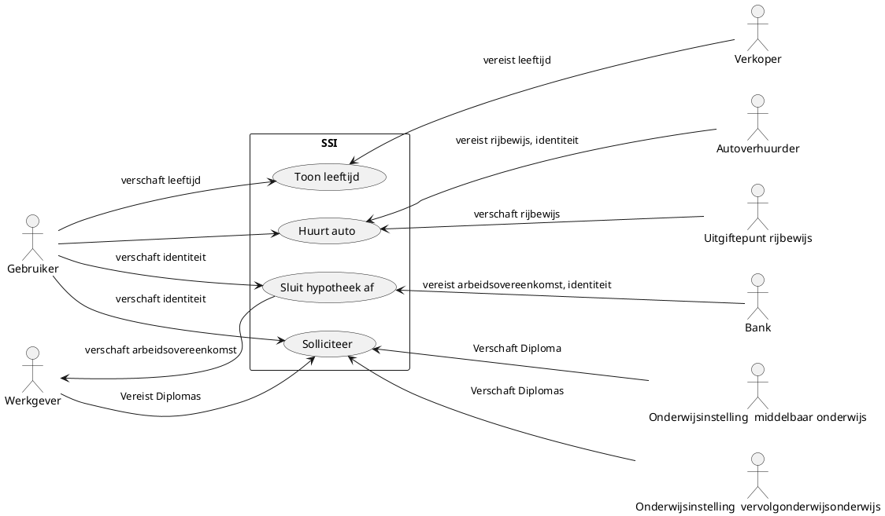
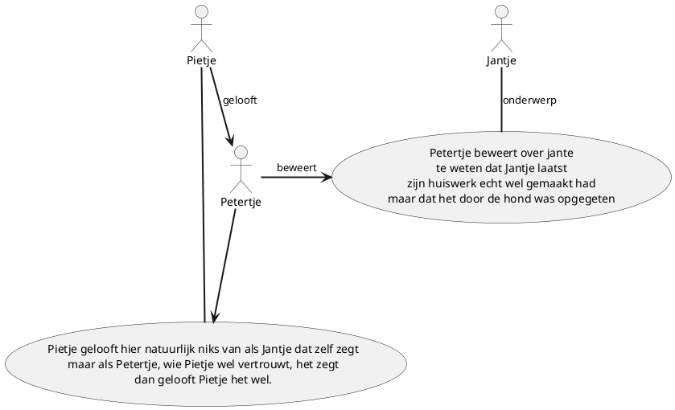

# Project 4 SSI Use Case Models

## Documenthistorie

| **Datum** | **Versie** | **Beschrijving** | **Auteur**  |
|-----------|------------|------------------|-------------|
|10-10-2022 | 0.1        | Initiele versie  | HDJRijnders |          
|1-12-2022  |1.0         |Versie na feedback: meer use cases|HDJRijnders  |          
|||||          

# Distributie

| **naam** | **0.1** |     |     |
| -------- | ------- | --- | --- |

## Accordering Document

| **Namens Opdrachtgever** | **Naam bedrijf** |
| ------------------------ | ---------------- |
| Naam ondertekenaar       | Naam bedrijf (?) |

| **Namens opdrachtnemer** | **Naam bedrijf** |
| ------------------------ | ---------------- |
| Naam ondertekenaar       | Selsovid         |

# Inhoudsopgave
- [Project 4 SSI Use Case Models](#project-4-ssi-use-case-models)
  - [Documenthistorie](#documenthistorie)
- [Distributie](#distributie)
  - [Accordering Document](#accordering-document)
- [Inhoudsopgave](#inhoudsopgave)
- [
1. Inleiding ](#1-inleiding-)
 - [1.1 Doel van dit document  ](#11-doel-van-dit-document--)
 - [1.2 Referenties ](#12-referenties-)
- [2. Opsomming actors ](#2-opsomming-actors-)
- [3. Opsomming Use Cases ](#3-opsomming-use-cases-)
- [4. Use Case Diagrams ](#4-use-case-diagrams-)

# 1. Inleiding 

## 1.1 Doel van dit document 

Dit document dient ter ondersteuning van project jaar 4: SSI (Self sovereign
id), het belicht de use cases en bijbehorende actors, ook wordt de scpe van de
opdracht en worden use cases gerangschikt en geprioritiseerd.

## 1.2 Referenties 

Dit is een lijst van alle documenten waarnaar in dit use case model worden
verwezen of op basis waarvan dit document tot stand is gekomen.

| **Titel**                        | **Versie** | **Auteur**    | **Vindplaats**                                                                                                                              |
| -------------------------------- | ---------- | ------------- | ------------------------------------------------------------------------------------------------------------------------------------------- |
| ssi-opdracht-omschrijving-v1.pdf | 1          | Jacob de Boer | https://blackboard.hanze.nl/bbcswebdav/pid-5585293-dt-content-rid-80696564_2/courses/itvt.1803.4-2-se-1819/ssi-opdracht-omschrijving-v1.pdf |
|                                  |            |               |                                                                                                                                             |

# 2. Opsomming actors 

| **Code** | **Actor**                                | **Omschrijving**                               | **Gewicht** |
| -------- | ---------------------------------------- | ---------------------------------------------- | ----------- |
| A1       | Gebruiker                                | De gebruiker van de SSI                        |             |
| A2       | Onderwijsinstelling middelbaar onderwijs | Instantie middelbare schooldiploma             |             |
| A3       | Onderwijsinstelling vervolgonderwijs     | Instantie diploma vervolgonderwijs             |             |
| A4       | Uitgiftepunt Rijbewijs                   | De uitgever van rijbewijzen in nederland       |             |
| A5       | Werkgever                                | Werkgever van degene waarvan het SSI is.       |             |
| A5       | verhuurder                               | Verhuurder van goederen                        |             |
| A6       | Verkoper                                 | Een verkoper van een winkel                    |             |
| A7       | Bank                                     | Bankinstelling om een hypotheek te verstrekken |             |

# 3. Opsomming Use Cases 

| **Code** | **Use case naam**                        | **Omschrijving**                                                                                                          | **Gewicht** | **prioritering** |
| -------- | ---------------------------------------- | ------------------------------------------------------------------------------------------------------------------------- | ----------- | ---------------- |
|**UC0**|**Gebruik van SSI**|**Een issuer wilt requests goedkeuren en of afkeuren**|||
|UC0-A|Goedkeuren request |Een issuer wil een request goedkeuren|||
|UC0-B|Een request afkeuren |Een issuer wilt een request afkeuren|||
|** UC1**      |** Kopen van leeftijdsgebonden artikelen**    |** Een gebruiker wilt alcohol kopen, benodigd is de leeftijd.**                                                                |** 1**           |** 1**                |
| UC1-A|Leeftijd tonen|Ik wil bier kopen in de supermarkt, daar moet ik mijn leeftijd voor laten zien|||
|UC1-B|Leeftijd verifieren|Ik werk in de supermarkt en moet een potentiele koper van bier zijn leeftijd verifieren|||
|**UC2**      |** Afsluiten van een dienst met voorwaarden** |** Een gebruiker wilt een hypotheek afsluiten om een huis te kunnen kopen, benodigd zijn de identiteit, arbeidsovereenkomst.** |**?**             |** 4**                |
| UC2-A|uitgeven van arbeidsovereenkomst|Ik ben een werkgever en ik wil een arbeidsovereenkomst kunnen uitgeven aan een werknemer|||
|UC2-B|Ontvangen van arbeidsovereenkomst|Als werknemer wil ik een arbeidsovereenkomst in ontvangst kunnen nemen|||
|UC2-C|Verifieren van arbeidsovereenkomst|Ik ben een bankmedewerker en voor het afsluiten van een hypotheek moet ik een arbeidsovereenkomst kunnen verifieren|||
|UC2-D|Uitgeven identiteit|Ik ben een overheid en ik wil uitgeven dat deze persoon daadwerkelijk deze persoon is.|||
|UC2-E|Ophalen identiteit|Ik ben een persoon en ik wil een bevestiging ophalen dat ik ben wie ik zeg dat ik ben|||
|UC2-F|Verifieren van identiteit|Ik ben een bankmedewerker en voor het afsluiten van een hypotheek moet ik een identiteit kunnen verifieren|||
|**UC3**      |** Solliciteren**                             |** Een gebruiker wilt solliciteren, daar zijn een ID en de diplomas van de middelbare school en de HBO instelling voor nodig** |**?**             |** 3**                |
| UC3-A|uitgeven van diploma|Ik ben een onderwijsinstelling en ik wil een diploma kunnen uitgeven aan een persoon die is afgestudeerd|||
|UC3-B|Ontvangen van diploma|Als afgestudeerde wil ik een diploma in ontvangst kunnen nemen|||
|UC3-C|Verifieren van diploma|Ik ben een werkgever en ik wil het diploma van mijn sollicitant kunnen verifieren|||
|UC3-D|Uitgeven identiteit|Ik ben een overheid en ik wil uitgeven dat deze persoon daadwerkelijk deze persoon is.|||
|UC3-E|Ophalen identiteit|Ik ben een persoon en ik wil een bevestiging ophalen dat ik ben wie ik zeg dat ik ben|||
|UC3-F|Verifieren van identiteit|Ik ben een werkgever en voor het aannemen van een werknemer moet ik een identiteit kunnen verifieren|||
|**UC4**      |** Huren van goederen**                       |** Een gebruiker wilt een auto huren, daar is vanuit de gebruiker een ID en een rijbewijs nodig**                              |**?**             |** 2**|
|UC4-A|Uitgifte van rijbewijs|Ik ben de RDW en wil rijbewijzen kunnen uitgeven|||
|UC4-B|Ontvangen van rijbewijs|Ik heb mijn rijexamen gehaald en wil mijn rijbewijs ophalen|||
|UC4-C|Verifieren van rijbewijs|Ik ben een verhuurbedrijf en ik wil verificeren of iemand een rijbewijs heeft|||
|UC4-D|Uitgeven identiteit|Ik ben een overheid en ik wil uitgeven dat deze persoon daadwerkelijk deze persoon is.|||
|UC4-E|Ophalen identiteit|Ik ben een persoon en ik wil een bevestiging ophalen dat ik ben wie ik zeg dat ik ben|||
|UC4-F|Verifieren van identiteit|Ik ben een verhuurbedrijf en voor het verhuren van goederen moet ik een identiteit kunnen verifieren||                |

# 4. Use Case Diagrams 

# Extra use cases

In een brainstormsessie heeft de projectgroep een mogelijke aanvulling op de use
cases bedacht. Deze zit niet in de besproken scope van dit project, en is
volgens het MoSCoW model een Wont have. Toch wordt deze hier onder
gedocumenteerd, in het kader van volledigheid van documentatie.

## Peer to peer statement issuing

Binnen het beoogde systeem is mogelijkheid tot een uitbreiding. In het
beschreven systeem staan drie duidelijk gescheiden rollen beschreven: issuer,
verifier en holder. De projectgroep kwam al snel met het besef dat een verifier
en holder vaak hetzelfde soort mensen zijn. In een supermarkt werken gewone,
normale mensen. Analoog hieraan is dat met fysieke identiteitskaarten het ook zo
werkt dat je je eigen kaart aan iedereen kan laten zien en iedereen kan
controleren dat de kaart klopt en welke gegevens er op de kaart staan.  
Hierin zijn holder en verifier dus hetzelfde. Hieruit kwam het idee dat er geen
twee verschillende apps worden gebouwd voor deze twee soorten gebruikers, in
plaats daarvan wordt er een enkele app gebouwd met functionaliteit voor beide.
Iedereen kan dan ook, net zoals in de situatie met fysieke ID kaarten, de
verifiable credentials van een ander controleren, mits de ander hier aan mee
werkt.

Een uitbreiding hierop is als je de issuer rol ook algemener bekijkt. Het
huidige systeem is gebouwd op het issuen van officiële documenten, dingen zoals
rijbewijs of opleidingsdiploma's. in algemene zin zijn dit gewoon "statements"
over een persoon. Je kunt het zien als "het RDW maakt als 'statement' over
Pietje dat hij mag rijden".

Dit systeem kan nog algemener worden gemaakt door ook iedereen een issuer te
laten zijn. Iedereen kan dan een "statement" over een ander persoon uitgeven.
Deze andere persoon kan vervolgens deze "statement" aan anderen laten zien met
bewijs dat persoon X dit heeft ondertekend. Een belangrijk besef is dan dat
verschillende handtekeningen enorm verschillende legitimiteit hebben.  
Als Pietje over Jantje de "statement" maakt 'Hij kan wel rijden" heeft dat niet
dezelfde legitimiteit als wanneer het RDW dat doet.  
Een belangrijk subsysteem dat hierbij nodig is is een manier voor mensen om te
weten wat de legitimiteit van een ondertekenaar is, en in welke context.

In dit verhaal is een "statement" een meer algemeen woord voor wat tot nu toe
een verifiable credential is genoemd.

