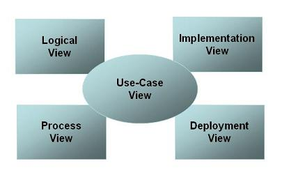

# Software architecture document

## Self-sovereign Identity

## Auteurs

Wouter de Boer  
Daniel Hofman  
Hylbren Rijnders  
Mees van Dijk

## Inleiding

### 1.1 Doel van dit document

Het software architectuur document bevat een uitgebreide architecturale kijk op
het systeem SSI. Het beschrijft een aantal verschillende architecturale views
van het systeem om zo verschillende aspecten van het systeem te belichten. Dit
document beschrijft de verschillend eRUP views op de software architectuur
volgens het 4+1 view model.

Het 4+1 model stelt de verschillende belanghebbenden in staat vanuit hun eigen
perspectief de invloed van de gekozen architectuur te bepalen.

<!-- De Process View (communicatie van processen) is niet als los hoofdstuk
uitgewerkt maar ondergebracht bij de hoofdstukken 3.3 en 5. -->

### 1.2 referenties

| titel                                   | Auteur      | vindplaats  |
| --------------------------------------- | ----------- | ----------- |
| Software architectuur document template | RUP op maat | RUP op maat |

## 2 Architecturale eisen

### 2.1 Niet-functionele eisen

Voor dit project zijn weinig niet-functionele eisen, dit komt omdat het doel van
het project is om een proof-of-concept applicatie te bouwen. In overleg met de
opdrachtgevers is kortgesloten dat dingen zoals performance, accessibility en
scalability niet belangrijk zijn.

De eisen die wel gegeven zijn:

#### 2.1.1 Snelheid

eis: De applicatie moet elke actie binnen een seconde kunnen uitvoeren.  
bron: opdrachtgever  
architecturale relevantie: Bij het ontwerpen en bouwen van de applicatie moet
worden gezorgd en getest dat de applicatie performant genoeg is om deze eis te
halen

### 2.2 Use case View

Het meest interessante, architecturaal gezien, aan de use-cases is dat er een
synthetische vorm van vertrouwen moet worden gebouwd. Dit model is synthetisch
omdat het niet alleen berust op menselijke afsrpaken, zoals vertrouwen normaal
wordt geimplementeerd, maar ook op bewijsbare technische manieren. Dit wordt
geimplementeerd met cryptografische certificaten. Deze werken op zo'n manier dat
een offciele instantie een eigen certificaat heeft en daarmee nieuwe
certificaten kan uitgeven aan vertrouwde partijen. Doordat mensen de "officiele
instantie" vertrouwen kunnen ze er automatisch van uit gaan dat de certificaten
die door deze instantie zijn uitgegeven ook te vertouwen zijn. Hier komt de
cryptografie van pas om te bewijzen dat een certificaat is uitgegeven door de
"officiele instantie". Deze instanties zijn in het geval van dit project van
tevoren bepaald, namelijk:

- Duo, voor diploma's
- Gemeente's, voor identiteitsbewijzen
- Werkgevers, voor inkomensverklaringen
- RDW, voor rijbewijzen

## 3 Logical view

### 3.1 Lagen

De applicatie bestaat uit meerdere lagen. Voor het uitvoeren van acties met de
applicatie moet er een presentatie/interactie laag zijn. Deze laag communiceert
met een service laag om deze acties waar te maken. Deze service laag praat met
een data laag, welke zich op elk device zelf zal bevinden.

TODO: verbeter dit

### 3.2 Deelsystemen

De applicatie vereist een aantal deelsystemen. In grote lijnen komen er een app,
een webapp en een api voor de webapp en app.

De app is bedoeld voor de gebruikers die willen verifyen en holden van
verifiable credentials (VC's).

De webapp is bedoeld voor issuers, die VC's willen uitgeven aan individueen.

De api is voor de webapp en de app, via de api krijgen de apps hun nieuwe VC's

### 3.3 Use case realizations

TODO: schrijf dit a.d.h.v. use cases

## 4 implementation view

### 4.1 Package structuur

Voor het implementeren van de applicatie worden een aantal packages geschreven.
Omdat niet elk deelsysteem in dezelfde taal wordt gebouwd wordt het niet altijd
mogelijk om code uit deze packages te delen. Voor de api worden een aantal
models geschreven die ook door de webapp kan hergebruiken. De app zal, omdat
deze niet dezelfde programmeertaal gebruikt, dit model zelf moeten dupliceren.

### 4.2 Invulling lagenstructuur

[Beschrijf hier de technische invulling van de in de Logical View onderscheiden
lagen. Benoem ook de regels voor een component om in een bepaalde laag opgenomen
te worden.]

### 4.3(Her)gebruik van componenten en frameworks

[Beschrijf hier de bij de bouw te (her)gebruiken componenten en frameworks
(intern en van derden). Dit voor zover ze niet bij de invulling van de
lagenstructuur zijn behandeld. Indien er bij de eisen bepaalde frameworks zijn
genoemd, dienen deze hier terug te komen.]

### 5. Deployment View

[Beschrijf hier de fysieke netwerk(hardware) configuraties waarop de software
gaat draaien. Beschrijf minimaal de configuraties van de verschillende fysieke
nodes (computers, CPUs), de interactie tussen (deel)systemen en de connecties
tussen deze nodes (bus, LAN, point-to-point, messaging, SOAP, http, https). Maak
gebruik van een deployment-diagram.]
